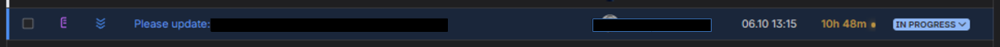
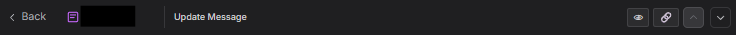
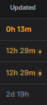
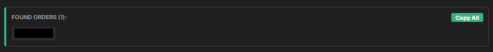
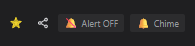
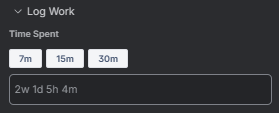

### Installation

**Manual Installation:**
1. Install Tampermonkey/Violentmonkey or similar extension
2. Create new script in extension's dashboard
3. Paste the code of the script that you want to use from this repo
4. Hit save and reload Jira tab

**Install from GitHub URL (Auto-updating):**
1. Navigate to the script you want to install in this repository on GitHub.
2. Click the "Raw" button to get the raw URL of the script.
3. In Tampermonkey, go to the "Utilities" tab.
4. Paste the raw URL in the "Import from URL" field and click "Install".
5. In the script's settings, check if the "Update URL" was correctly set to enable auto-updates.

### Scripts

* **`bot_human_highlighter.js`**: Visually separates monitoring alerts from human requests, and cleans up long subject lines.
* **`compact_ticket_table.js`**: Makes the Jira service desk ticket list table more compact and allows hiding or resizing specific columns.
  

    
Preview

     
    
  

* **`header_proxy.js`**: Hides main header with a toggle button to reveal it for editing.
  

    
Preview

     
    
  

* **`heatmap_update_time.js`**: Colors tickets by update age, adds unread dot, and auto-cleans old view data.
  

    
Preview

     
    
  

* **`order_number_extractor.js`**: Extracts 10xx/30xx orders from the issue description and lists them for quick copying.
  

    
Preview

     
    
  

* **`queue_alert.js`**: Plays an alert sound when tickets are in the "Waiting for Triage" queue. Repeats every 30/5 seconds while tickets remain, with a toggle button and two modes (normal/aggressive).
  

    
Preview

     
    
  

* **`recovery_signal.js`** (deprecated): Adds a pulsing green indicator if the 'recovered' label is present on the issue.
* **`signature.js`**: Adds a button to insert a standard signature in the Jira comment editor.
* **`ticket_list_highlighter.js`**: Dynamically highlights rows in the Jira issue list when their status is "In Progress".
  

    
Preview

     
    
  

* **`worklog_helper.js`**: Auto-expands the 'Log Work' modal and adds quick time buttons for logging.
  

    
Preview

     
    
  

